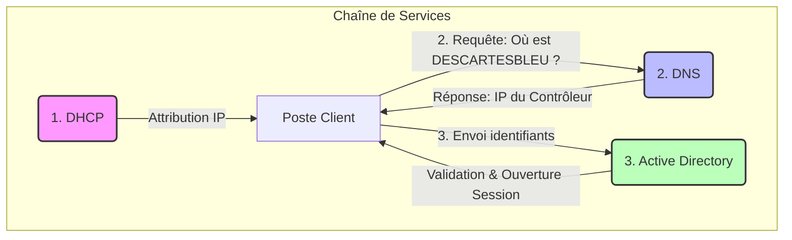

# 📘 TP B1-S2 : Des serveurs aux services

---

Ce dépôt regroupe les réponses et analyses du TD portant sur l'infrastructure matérielle des serveurs et la logique des services réseaux. Il couvre l'étude des facteurs de forme (Tour, Rack, Lame), la redondance matérielle, ainsi que la chaîne de services nécessaire à l'authentification d'un poste client sur un domaine.

---

## `📑`︲Sommaire (cliquez pour accéder directement à la section souhaitée)

1. [`📘`︲Activité #1 : Découverte des configurations matérielles.](#1-facteurs-de-forme-form-factors)

   * [`📐`︲Facteurs de forme (Tour, Rack, Lame) et Sockets.](#1-facteurs-de-forme-form-factors)
   * [`⚡`︲Particularités électriques et Redondance.](#3-particularité-de-lalimentation)
   * [`🧩`︲Architecture Serveur Lame et Châssis.](#6-serveur-lame-et-châssis-annexe-4)
   * [`📊`︲Tableau comparatif des serveurs Dell PowerEdge.](#7-fiche-récapitulative-des-serveurs)

   ---

2. [`🌐`︲Activité #2 : Chaîne de services et connexion client.](#1-à-3-identification-des-services)

   * [`🔍`︲Identification des protocoles (DHCP, DNS, AD).](#1-à-3-identification-des-services)
   * [`🔄`︲Schématisation du flux d'authentification.](#4-schéma-de-lordre-dappel-des-services)
   * [`📂`︲Services complémentaires en réseau local.](#5-autres-services-réseaux)

   ---

3. [`📚`︲Ressources et Annexes.](#annexes)

---

### `📘`**︲Activité #1 : Découverte des configurations matérielles.**

---

## `📐`︲Facteurs de forme des serveurs (Tour, Rack, Lame)

Dans une infrastructure serveur, le **facteur de forme** définit le **format physique**, le **mode d’intégration** et les **cas d’usage** du matériel.
À partir des annexes fournies, on distingue **trois formats majeurs** :

---

### `🖥️`︲Serveur **Tour (Tower)**

Le serveur **Tour** reprend une conception proche d’un PC de bureau, tout en intégrant des composants **professionnels** (CPU serveur, RAM ECC, stockage renforcé).

* 📦 Format autonome, non monté en baie
* 🔧 Installation simple, sans infrastructure dédiée
* 🎯 Adapté aux **TPE / PME** ou environnements à faible densité

📌 *Exemples : Annexes 1 et 2*

---

### `🗄️`︲Serveur **Rack**

Le serveur **Rack** est conçu pour être installé horizontalement dans une **baie informatique standardisée (19")**.

* 📏 Hauteur exprimée en **Unités de Rack (U)**
* 🔥 Densité élevée et refroidissement optimisé
* 🧠 Centralisation et maintenance facilitées

📌 *Exemple : Annexe 3*

---

### `🧩`︲Serveur **Lame (Blade)**

Le serveur **Lame** est un module compact inséré dans un **châssis commun**, qui mutualise les ressources critiques.

* ⚡ Alimentation partagée
* ❄️ Refroidissement centralisé
* 🌐 Connectivité réseau intégrée
* 📈 Très forte densité de calcul

📌 *Exemple : Annexe 4*

---

### `✅`︲Synthèse rapide

| Facteur de forme | Usage principal          | Infrastructure requise |
| ---------------- | ------------------------ | ---------------------- |
| **Tour**         | Petites structures       | Aucune                 |
| **Rack**         | Datacenters / PME        | Baie informatique      |
| **Lame**         | Environnements critiques | Châssis dédié          |

---

💡 **À retenir** :
Le choix du facteur de forme dépend directement des **besoins en performance**, de la **scalabilité**, de la **redondance** et de l’**espace disponible**.

---

🔁 **À toi** :
👉 Dis-moi **la prochaine question** à réécrire (socket, alimentation, redondance, services, etc.).
On déroule proprement, sans précipitation.

---
---
---

> **Activité #2** : Les services requis lors de la connexion d'un poste client.
> Cette section analyse la **chaîne de services** sollicitée lorsqu'un utilisateur s'authentifie sur un domaine Windows (ex: *DESCARTESBLEU*).

---

## 1 à 3. Identification des Services

Pour ouvrir une session sur le réseau, trois services fondamentaux interviennent successivement. Voici le détail technique de chacun :

| ID | Description de la demande | Service Identifié | Protocole & Port | Rôle Technique |
| :--- | :--- | :--- | :--- | :--- |
| **1** | Inscription et identification unique sur le réseau. | **DHCP** (Dynamic Host Configuration Protocol) | **UDP** Ports 67 (Serveur) & 68 (Client) | Distribue automatiquement une configuration IP (Adresse IP, Masque, Passerelle, DNS) pour que la machine puisse communiquer sur le réseau. |
| **2** | Reconnaissance du domaine *DESCARTESBLEU*. | **DNS** (Domain Name System) | **UDP / TCP** Port 53 | Assure la **résolution de noms**. Il traduit le nom de domaine (littéral) en adresse IP (numérique) pour localiser le contrôleur de domaine. |
| **3** | Authentification de l'utilisateur (Login/Mdp). | **Active Directory / LDAP** (Lightweight Directory Access Protocol) | **TCP / UDP** Port 389 (LDAP) ou 88 (Kerberos) | Service d'annuaire centralisé. Il vérifie les identifiants (couple utilisateur/mot de passe) et accorde les droits d'accès. |

---

## 4. Schéma de l'ordre d'appel des services

Lorsqu'un ordinateur démarre et qu'un utilisateur tente de se connecter, l'ordre chronologique des appels est le suivant :

---

> **Explication du flux :**
> 1.  **Connectivité :** Le PC demande une IP au **DHCP** pour exister sur le réseau.
> 2.  **Localisation :** Le PC demande au **DNS** l'adresse du serveur qui gère le domaine *DESCARTESBLEU*.
> 3.  **Authentification :** Le PC contacte le serveur identifié (**AD**) pour vérifier le mot de passe.

---

## 5. Autres services réseaux

Dans un environnement réseau local d'entreprise (LAN), une fois l'utilisateur connecté, d'autres services sont couramment utilisés :

*   **Serveur de Fichiers (SMB/CIFS) :** Pour le partage de documents communs ou de répertoires personnels (*Port 445*).
*   **Serveur d'Impression :** Pour gérer les files d'attente et les pilotes des imprimantes partagées.
*   **Serveur de Temps (NTP) :** Pour synchroniser l'heure de toutes les machines (crucial pour la sécurité Kerberos, *Port 123*).
*   **Proxy / Filtrage Web :** Pour sécuriser et contrôler l'accès à Internet.
*   **Service de déploiement (WDS/FOG) :** Pour installer des systèmes d'exploitation sur les postes à travers le réseau.

---
