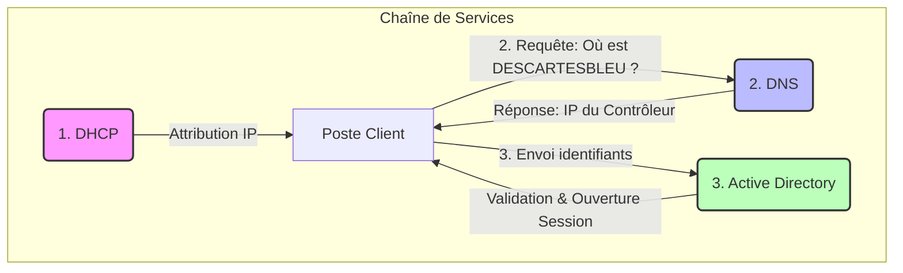

# 📘 TP B1-S2 : Des serveurs aux services

> **Activité #1** : Découverte des configurations matérielles de serveurs.
> Ce document présente l'analyse des facteurs de forme, des composants et de la redondance des équipements serveurs basés sur les gammes Dell PowerEdge.

---

Voici le header et le sommaire, strictement adaptés au style visuel et structurel de l'exemple fourni, pour ton TP **"Des serveurs aux services"**.

---

# `🖥️`︲Documentation TP : Des serveurs aux services (B1-S2).

---

Ce dépôt regroupe les réponses et analyses du TD portant sur l'infrastructure matérielle des serveurs et la logique des services réseaux. Il couvre l'étude des facteurs de forme (Tour, Rack, Lame), la redondance matérielle, ainsi que la chaîne de services nécessaire à l'authentification d'un poste client sur un domaine.

---

## `📑`︲Sommaire (cliquez pour accéder directement à la section souhaitée)

1. [`📘`︲Activité #1 : Découverte des configurations matérielles.](#1-facteurs-de-forme-form-factors)

   * [`📐`︲Facteurs de forme (Tour, Rack, Lame) et Sockets.](#1-facteurs-de-forme-form-factors)
   * [`⚡`︲Particularités électriques et Redondance.](#3-particularité-de-lalimentation)
   * [`🧩`︲Architecture Serveur Lame et Châssis.](#6-serveur-lame-et-châssis-annexe-4)
   * [`📊`︲Tableau comparatif des serveurs Dell PowerEdge.](#7-fiche-récapitulative-des-serveurs)

   ---

2. [`🌐`︲Activité #2 : Chaîne de services et connexion client.](#1-à-3-identification-des-services)

   * [`🔍`︲Identification des protocoles (DHCP, DNS, AD).](#1-à-3-identification-des-services)
   * [`🔄`︲Schématisation du flux d'authentification.](#4-schéma-de-lordre-dappel-des-services)
   * [`📂`︲Services complémentaires en réseau local.](#5-autres-services-réseaux)

   ---

3. [`📚`︲Ressources et Annexes.](#annexes)

---

## 1. Facteurs de forme (Form Factors)

En analysant les annexes fournies, nous distinguons trois principaux facteurs de forme pour les serveurs :

*   **Format Tour (Tower) :** Similaire à une unité centrale de PC de bureau classique, mais souvent plus volumineux (Ex: *Annexe 1 & 2*).
*   **Format Rack :** Conçu pour être empilé horizontalement dans une armoire informatique standardisée (Ex: *Annexe 3*).
*   **Format Lame (Blade) :** Module compact conçu pour être inséré verticalement dans un châssis commun qui mutualise les ressources (Ex: *Annexe 4*).

## 2. Le Socket

Le nombre de **sockets** désigne le nombre d'emplacements physiques présents sur la carte mère pour accueillir des processeurs (CPU).
*   **1 Socket :** Le serveur ne peut accueillir qu'un seul processeur physique.
*   **2 Sockets :** Le serveur peut accueillir deux processeurs physiques travaillant en parallèle (multiprocessing).

## 3. Particularité de l'alimentation

Contrairement à un poste client (PC standard) qui possède une seule alimentation, la particularité majeure d'un serveur est la **redondance**.
La plupart des serveurs (hors entrée de gamme) possèdent **deux blocs d'alimentation (ou plus)**. Cela permet de connecter le serveur à deux sources électriques différentes. Si une alimentation grille ou si une source de courant est coupée, le serveur continue de fonctionner sans interruption.

## 4. Stockage des serveurs Rack

L'équipement réseau nécessaire pour stocker les serveurs de type Rack est une **Baie informatique** (aussi appelée *Armoire Rack* ou *Cabinet*).

> **Fonctionnement :** C'est une armoire métallique standardisée (généralement 19 pouces de large) permettant de visser les serveurs les uns au-dessus des autres pour optimiser l'espace et la gestion du refroidissement.

## 5. Signification de l'abréviation "1U"

L'abréviation **1U** désigne une **Unité de Rack** (Rack Unit). C'est l'unité de mesure standard de la hauteur d'un équipement monté en rack.

*   **1U = 1,75 pouces (soit 44,45 mm).**

*Note : Le serveur de l'Annexe 3 est un serveur "1U", ce qui signifie qu'il occupe une seule hauteur d'unité dans la baie.*

## 6. Serveur Lame et Châssis (Annexe 4)

### (a) Rôle du châssis
Le châssis est un boîtier commun qui accueille plusieurs serveurs lames. Son rôle est de **mutualiser les ressources** :
*   L'alimentation électrique.
*   Le système de refroidissement (ventilateurs).
*   La connectivité réseau (via des switchs intégrés à l'arrière).
*   La gestion centralisée du matériel.

### (b) Nombre d'alimentations
D'après l'annexe 4 (section *Alimentation*), il est indiqué "Niveau du boîtier". Pour un châssis de type **Dell M1000e** (cité dans le document), il y a généralement jusqu'à **6 blocs d'alimentation** présents pour assurer la charge de toutes les lames insérées.

---

## 7. Fiche récapitulative des serveurs

Voici le comparatif technique des serveurs étudiés :

| Caractéristiques | Dell PowerEdge T140 (Annexe 1) | Dell PowerEdge T440 (Annexe 2) | Dell PowerEdge R640 (Annexe 3) | Dell PowerEdge M830 (Annexe 4) |
| :--- | :--- | :--- | :--- | :--- |
| **(a) Facteur de forme** | Tour | Tour (ou Rack 5U) | Rack 1U | Lame (Blade) |
| **(b) Nb Processeurs Max** | 1 | 2 | 2 | 4 |
| **(c) Mémoire Max / Slots** | 64 Go / 4 slots | 512 Go - 1 To / 16 slots | 3 To / 24 slots | 3 To / 48 slots |
| **(d) Baies de stockage Max** | 4 disques (3,5") | 8 (3,5") ou 16 (2,5") | 10 (2,5") ou 4 (3,5") | 12 (via extension) ou 4 locales |
| **(e) Alimentations Max** | 1 (365W) | 2 (Redondantes) | 2 (Redondantes) | Fournie par le châssis |

---

## 8. Intérêt de la redondance

La redondance vise à assurer la **Haute Disponibilité** (High Availability) et la tolérance aux pannes. Si un composant tombe en panne, le système continue de fonctionner.

*   **Processeur :** Si un processeur échoue (rare) ou est surchargé, le second socket peut prendre le relais ou répartir la charge de calcul.
*   **Mémoire (RAM) :** Les technologies comme l'ECC (Error Correcting Code) ou le "Memory Mirroring" permettent de corriger les erreurs de données ou de copier les données sur deux barrettes simultanément pour éviter les écrans bleus (crashs).
*   **Stockage (Disques) :** L'utilisation du **RAID** (ex: RAID 1, RAID 5) permet de continuer à accéder aux données même si un ou plusieurs disques durs tombent en panne physiquement.
*   **Alimentation :** Assure la continuité de service électrique. Si un bloc d'alimentation grille ou si un câble est débranché accidentellement, le serveur reste allumé sur le second bloc.

---

> **Activité #2** : Les services requis lors de la connexion d'un poste client.
> Cette section analyse la **chaîne de services** sollicitée lorsqu'un utilisateur s'authentifie sur un domaine Windows (ex: *DESCARTESBLEU*).

---

## 1 à 3. Identification des Services

Pour ouvrir une session sur le réseau, trois services fondamentaux interviennent successivement. Voici le détail technique de chacun :

| ID | Description de la demande | Service Identifié | Protocole & Port | Rôle Technique |
| :--- | :--- | :--- | :--- | :--- |
| **1** | Inscription et identification unique sur le réseau. | **DHCP** (Dynamic Host Configuration Protocol) | **UDP** Ports 67 (Serveur) & 68 (Client) | Distribue automatiquement une configuration IP (Adresse IP, Masque, Passerelle, DNS) pour que la machine puisse communiquer sur le réseau. |
| **2** | Reconnaissance du domaine *DESCARTESBLEU*. | **DNS** (Domain Name System) | **UDP / TCP** Port 53 | Assure la **résolution de noms**. Il traduit le nom de domaine (littéral) en adresse IP (numérique) pour localiser le contrôleur de domaine. |
| **3** | Authentification de l'utilisateur (Login/Mdp). | **Active Directory / LDAP** (Lightweight Directory Access Protocol) | **TCP / UDP** Port 389 (LDAP) ou 88 (Kerberos) | Service d'annuaire centralisé. Il vérifie les identifiants (couple utilisateur/mot de passe) et accorde les droits d'accès. |

---

## 4. Schéma de l'ordre d'appel des services

Lorsqu'un ordinateur démarre et qu'un utilisateur tente de se connecter, l'ordre chronologique des appels est le suivant :

---

> **Explication du flux :**
> 1.  **Connectivité :** Le PC demande une IP au **DHCP** pour exister sur le réseau.
> 2.  **Localisation :** Le PC demande au **DNS** l'adresse du serveur qui gère le domaine *DESCARTESBLEU*.
> 3.  **Authentification :** Le PC contacte le serveur identifié (**AD**) pour vérifier le mot de passe.

---

## 5. Autres services réseaux

Dans un environnement réseau local d'entreprise (LAN), une fois l'utilisateur connecté, d'autres services sont couramment utilisés :

*   **Serveur de Fichiers (SMB/CIFS) :** Pour le partage de documents communs ou de répertoires personnels (*Port 445*).
*   **Serveur d'Impression :** Pour gérer les files d'attente et les pilotes des imprimantes partagées.
*   **Serveur de Temps (NTP) :** Pour synchroniser l'heure de toutes les machines (crucial pour la sécurité Kerberos, *Port 123*).
*   **Proxy / Filtrage Web :** Pour sécuriser et contrôler l'accès à Internet.
*   **Service de déploiement (WDS/FOG) :** Pour installer des systèmes d'exploitation sur les postes à travers le réseau.

---
