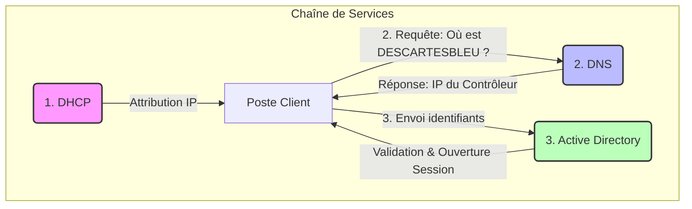

# 📘 TP B1-S2 : Des serveurs aux services

---

Ce dépôt regroupe les réponses et analyses du TD portant sur l'infrastructure matérielle des serveurs et la logique des services réseaux. Il couvre l'étude des facteurs de forme (Tour, Rack, Lame), la redondance matérielle, ainsi que la chaîne de services nécessaire à l'authentification d'un poste client sur un domaine.

---

## `📑`︲Sommaire (cliquez pour accéder directement à la section souhaitée)

1. [`📘`︲Activité #1 : Découverte des configurations matérielles.](#1-facteurs-de-forme-form-factors)

   * [`📐`︲Facteurs de forme (Tour, Rack, Lame) et Sockets.](#1-facteurs-de-forme-form-factors)
   * [`⚡`︲Particularités électriques et Redondance.](#3-particularité-de-lalimentation)
   * [`🧩`︲Architecture Serveur Lame et Châssis.](#6-serveur-lame-et-châssis-annexe-4)
   * [`📊`︲Tableau comparatif des serveurs Dell PowerEdge.](#7-fiche-récapitulative-des-serveurs)

   ---

2. [`🌐`︲Activité #2 : Chaîne de services et connexion client.](#1-à-3-identification-des-services)

   * [`🔍`︲Identification des protocoles (DHCP, DNS, AD).](#1-à-3-identification-des-services)
   * [`🔄`︲Schématisation du flux d'authentification.](#4-schéma-de-lordre-dappel-des-services)
   * [`📂`︲Services complémentaires en réseau local.](#5-autres-services-réseaux)

   ---

3. [`📚`︲Ressources et Annexes.](#annexes)

---

### `📘`**︲Activité #1 : Découverte des configurations matérielles.**

---

## `📐`︲Facteurs de forme des serveurs (Tour, Rack, Lame)

Dans une infrastructure serveur, le **facteur de forme** définit le **format physique**, le **mode d’intégration** et les **cas d’usage** du matériel.
À partir des annexes fournies, on distingue **trois formats majeurs** :

---

### `🖥️`︲Serveur **Tour (Tower)**

Le serveur **Tour** reprend une conception proche d’un PC de bureau, tout en intégrant des composants **professionnels** (CPU serveur, RAM ECC, stockage renforcé).

* 📦 Format autonome, non monté en baie
* 🔧 Installation simple, sans infrastructure dédiée
* 🎯 Adapté aux **TPE / PME** ou environnements à faible densité

📌 *Exemples : Annexes 1 et 2*

---

### `🗄️`︲Serveur **Rack**

Le serveur **Rack** est conçu pour être installé horizontalement dans une **baie informatique standardisée (19")**.

* 📏 Hauteur exprimée en **Unités de Rack (U)**
* 🔥 Densité élevée et refroidissement optimisé
* 🧠 Centralisation et maintenance facilitées

📌 *Exemple : Annexe 3*

---

### `🧩`︲Serveur **Lame (Blade)**

Le serveur **Lame** est un module compact inséré dans un **châssis commun**, qui mutualise les ressources critiques.

* ⚡ Alimentation partagée
* ❄️ Refroidissement centralisé
* 🌐 Connectivité réseau intégrée
* 📈 Très forte densité de calcul

📌 *Exemple : Annexe 4*

---

### `✅`︲Synthèse rapide

| Facteur de forme | Usage principal          | Infrastructure requise |
| ---------------- | ------------------------ | ---------------------- |
| **Tour**         | Petites structures       | Aucune                 |
| **Rack**         | Datacenters / PME        | Baie informatique      |
| **Lame**         | Environnements critiques | Châssis dédié          |

---

💡 **À retenir** :
Le choix du facteur de forme dépend directement des **besoins en performance**, de la **scalabilité**, de la **redondance** et de l’**espace disponible**.

---

## `🌐`︲Activité #2 — Chaîne de services lors de la connexion d’un poste client

Cette activité vise à identifier et comprendre la **chaîne de services réseau** sollicitée lorsqu’un poste client démarre et qu’un utilisateur s’authentifie sur un **domaine Windows**
*(exemple : `DESCARTESBLEU`)*.

L’objectif est simple :
👉 **comprendre qui fait quoi, dans quel ordre, et pourquoi**.

---

## `🔍`︲Identification des services essentiels (1 à 3)

Lors de l’ouverture de session, **trois services fondamentaux** interviennent **successivement**.
Sans l’un d’eux, la connexion au domaine est **impossible**.

---

### `1️⃣`︲DHCP — Attribution de l’identité réseau

📌 **Service :** DHCP *(Dynamic Host Configuration Protocol)*
📡 **Protocole :** UDP — Ports **67 (serveur)** / **68 (client)**

🔧 **Rôle technique :**

* Attribution automatique d’une **adresse IP**
* Fourniture des paramètres réseau essentiels :

  * Masque de sous-réseau
  * Passerelle par défaut
  * Serveur DNS

💡 **Sans DHCP** :
➡️ Le poste n’existe pas sur le réseau.
➡️ Aucun échange réseau possible.

---

### `2️⃣`︲DNS — Localisation du domaine

📌 **Service :** DNS *(Domain Name System)*
📡 **Protocole :** UDP / TCP — Port **53**

🔧 **Rôle technique :**

* Traduction du nom de domaine (`DESCARTESBLEU`)
* Résolution vers l’**adresse IP du contrôleur de domaine**

💡 **Sans DNS** :
➡️ Le poste ne sait pas **où se trouve le domaine**.
➡️ L’authentification ne peut pas démarrer.

---

### `3️⃣`︲Active Directory — Authentification de l’utilisateur

📌 **Service :** Active Directory
📡 **Protocoles associés :**

* **LDAP** — Port **389**
* **Kerberos** — Port **88**

🔧 **Rôle technique :**

* Vérification du couple **utilisateur / mot de passe**
* Attribution des droits et des stratégies (GPO)
* Ouverture de la session utilisateur

💡 **Sans Active Directory** :
➡️ Pas d’authentification centralisée
➡️ Pas de gestion des utilisateurs ni des droits

---

## `🔄`︲Ordre chronologique d’appel des services

L’ordre d’appel est **strict** et **non négociable** :

---

### `🧠`︲Lecture du flux

1. **Connectivité**
   👉 Le poste obtient une configuration IP via **DHCP**

2. **Localisation**
   👉 Le poste interroge le **DNS** pour trouver le domaine

3. **Authentification**
   👉 Le poste contacte l’**Active Directory** pour valider l’utilisateur

---

## `📂`︲Services réseaux complémentaires (post-authentification)

Une fois l’utilisateur connecté, d’autres services entrent en jeu dans un environnement LAN :

* 📁 **Serveur de fichiers (SMB/CIFS)** — Port **445**
* 🖨️ **Serveur d’impression**
* ⏱️ **Serveur de temps (NTP)** — Port **123**
* 🌐 **Proxy / filtrage web**
* 🚀 **Service de déploiement** *(WDS / FOG)*

Ces services ne sont **pas nécessaires à la connexion**,
mais **indispensables au fonctionnement quotidien** du poste.

---

**À retenir** :
La connexion à un domaine repose sur une **chaîne de dépendances**.
**DHCP → DNS → Active Directory**
Un maillon cassé = **connexion impossible**.

---
