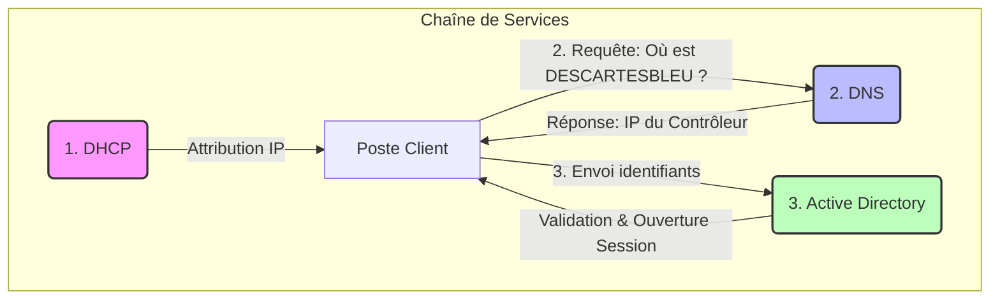

# 📘 TP B1-S2 : Des serveurs aux services

---

Ce dépôt regroupe les réponses et analyses du TD portant sury l'infrastructure matérielle des serveurs et la logique des services réseaux. Il couvre l'étude des facteurs de forme (Tour, Rack, Lame), la redondance matérielle, ainsi que la chaîne de services nécessaire à l'authentification d'un poste client sur un domaine.

---

## `📑`︲Sommaire (cliquez pour accéder directement à la section souhaitée)

1. [`📘`︲Activité #1 : Découverte des configurations matérielles.](#1-facteurs-de-forme-form-factors)

   * [`📐`︲Facteurs de forme (Tour, Rack, Lame) et Sockets.](#1-facteurs-de-forme-form-factors)
   * [`⚡`︲Particularités électriques et Redondance.](#3-particularité-de-lalimentation)
   * [`🧩`︲Architecture Serveur Lame et Châssis.](#6-serveur-lame-et-châssis-annexe-4)
   * [`📊`︲Tableau comparatif des serveurs Dell PowerEdge.](#7-fiche-récapitulative-des-serveurs)

   ---

2. [`🌐`︲Activité #2 : Chaîne de services et connexion client.](#1-à-3-identification-des-services)

   * [`🔍`︲Identification des protocoles (DHCP, DNS, AD).](#1-à-3-identification-des-services)
   * [`🔄`︲Schématisation du flux d'authentification.](#4-schéma-de-lordre-dappel-des-services)
   * [`📂`︲Services complémentaires en réseau local.](#5-autres-services-réseaux)

   ---

3. [`📚`︲Ressources et Annexes.](#annexes)

---

### `📘`**︲Activité #1 : Découverte des configurations matérielles.**

---

### 🔧 Précisions Techniques (Q2 à Q5)

* **Le Socket (Q2) :** Il s'agit de l'emplacement physique sur la carte mère destiné à accueillir un processeur (CPU). Le nombre de sockets détermine la capacité d'évolution du serveur : un serveur "2 sockets" peut fonctionner avec un seul CPU au départ, puis en recevoir un deuxième plus tard pour doubler sa puissance de calcul.
* **Particularité de l'alimentation (Q3) :** Contrairement à un PC client, un serveur dispose d'une **alimentation redondante** (deux blocs ou plus). Ces blocs sont **extractibles à chaud (Hot-Plug)**, permettant de remplacer une alimentation défectueuse sans éteindre le serveur.
* **Stockage des serveurs Rack (Q4) :** Pour installer des serveurs au format Rack, on utilise une **baie informatique (ou armoire 19 pouces)**. Elle permet de centraliser le matériel, d'optimiser le câblage et de garantir un flux d'air de refroidissement efficace.
* **Signification du format 1U (Q5) :** Le "U" signifie **Unité de rack**. C'est une unité de mesure standardisée pour la hauteur des équipements. **1U = 1,75 pouce (soit environ 4,445 cm)**. Un serveur 1U est donc très plat, tandis qu'un serveur 2U prendra deux fois plus de place en hauteur dans la baie.

## `📐`︲Facteurs de forme des serveurs (Tour, Rack, Lame)

Dans une infrastructure serveur, le **facteur de forme** définit le **format physique**, le **mode d’intégration** et les **cas d’usage** du matériel.
À partir des annexes fournies, on distingue **trois formats majeurs** :

---

### `🖥️`︲Serveur **Tour (Tower)**

Le serveur **Tour** reprend une conception proche d’un PC de bureau, tout en intégrant des composants **professionnels** (CPU serveur, RAM ECC, stockage renforcé).

* 📦 Format autonome, non monté en baie
* 🔧 Installation simple, sans infrastructure dédiée
* 🎯 Adapté aux **TPE / PME** ou environnements à faible densité

📌 *Exemples : Annexes 1 et 2*

---

### `🗄️`︲Serveur **Rack**

Le serveur **Rack** est conçu pour être installé horizontalement dans une **baie informatique standardisée (19")**.

* 📏 Hauteur exprimée en **Unités de Rack (U)**
* 🔥 Densité élevée et refroidissement optimisé
* 🧠 Centralisation et maintenance facilitées

📌 *Exemple : Annexe 3*

---

### `🧩`︲Serveur **Lame (Blade)**

### 🧩 L'écosystème du Serveur Lame (Q6)

Le serveur Dell PowerEdge M830 (Annexe 4) est une "lame" qui ne peut pas fonctionner seule. Elle doit être insérée dans un **châssis**.

* **Rôle du Châssis (Q6.a) :** Le châssis fait office de "colonne vertébrale". Il mutualise les ressources pour toutes les lames qu'il héberge :
    * **Énergie :** Alimentations partagées de forte puissance.
    * **Refroidissement :** Ventilation commune pour tout le châssis.
    * **Connectivité :** Switches réseau et stockage intégrés à l'arrière du châssis.
    * **Gestion :** Interface d'administration centralisée pour toutes les lames.
* **Nombre d'alimentations (Q6.b) :** Sur ce type d'équipement (comme le châssis Dell PowerEdge M1000e), on trouve généralement jusqu'à **6 blocs d'alimentation** haute efficacité pour garantir une redondance totale même en cas de panne de plusieurs sources électriques.

Le serveur **Lame** est un module compact inséré dans un **châssis commun**, qui mutualise les ressources critiques.

* ⚡ Alimentation partagée
* ❄️ Refroidissement centralisé
* 🌐 Connectivité réseau intégrée
* 📈 Très forte densité de calcul

📌 *Exemple : Annexe 4*

---

### `✅`︲Synthèse rapide

| Facteur de forme | Usage principal          | Infrastructure requise |
| ---------------- | ------------------------ | ---------------------- |
| **Tour**         | Petites structures       | Aucune                 |
| **Rack**         | Datacenters / PME        | Baie informatique      |
| **Lame**         | Environnements critiques | Châssis dédié          |

---

> [!NOTE]
> Le choix du facteur de forme dépend directement des **besoins en performance**, de la **scalabilité**, de la **redondance** et de l’**espace disponible**.

---

## `🌐`︲Activité #2 — Chaîne de services lors de la connexion d’un poste client

Cette activité vise à identifier et comprendre la **chaîne de services réseau** sollicitée lorsqu’un poste client démarre et qu’un utilisateur s’authentifie sur un **domaine Windows**
*(exemple : `DESCARTESBLEU`)*.

L’objectif est simple :
👉 **comprendre qui fait quoi, dans quel ordre, et pourquoi**.

---

## `🔍`︲Identification des services essentiels (1 à 3)

Lors de l’ouverture de session, **trois services fondamentaux** interviennent **successivement**.
Sans l’un d’eux, la connexion au domaine est **impossible**.

---

### `1️⃣`︲DHCP — Attribution de l’identité réseau

📌 **Service :** DHCP *(Dynamic Host Configuration Protocol)*
📡 **Protocole :** UDP — Ports **67 (serveur)** / **68 (client)**

🔧 **Rôle technique :**

* Attribution automatique d’une **adresse IP**
* Fourniture des paramètres réseau essentiels :

  * Masque de sous-réseau
  * Passerelle par défaut
  * Serveur DNS
  
> [!NOTE]
>  **Sans DHCP** :
> ➡️ Le poste n’existe pas sur le réseau.
> ➡️ Aucun échange réseau possible

---

### `2️⃣`︲DNS — Localisation du domaine

📌 **Service :** DNS *(Domain Name System)*
📡 **Protocole :** UDP / TCP — Port **53**

🔧 **Rôle technique :**

* Traduction du nom de domaine (`DESCARTESBLEU`)
* Résolution vers l’**adresse IP du contrôleur de domaine**

> [!NOTE]
> **Sans DNS** :
> ➡️ Le poste ne sait pas **où se trouve le domaine**.
> ➡️ L’authentification ne peut pas démarrer.

---

### `3️⃣`︲Active Directory — Authentification de l’utilisateur

📌 **Service :** Active Directory
📡 **Protocoles associés :**

* **LDAP** — Port **389**
* **Kerberos** — Port **88**

🔧 **Rôle technique :**

* Vérification du couple **utilisateur / mot de passe**
* Attribution des droits et des stratégies (GPO)
* Ouverture de la session utilisateur

> [!NOTE]
>  **Sans Active Directory** :
> ➡️ Pas d’authentification centralisée
> ➡️ Pas de gestion des utilisateurs ni des droits

---

## `🔄`︲Ordre chronologique d’appel des services

L’ordre d’appel est **strict** et **non négociable** :

```mermaid
graph TD
    Client[Poste Client]
    
    subgraph "Chaîne de Services"
    Step1(1. DHCP) -->|Attribution IP| Client
    Client -->|2. Requête: Où est DESCARTESBLEU ?| Step2(2. DNS)
    Step2 -->|Réponse: IP du Contrôleur| Client
    Client -->|3. Envoi identifiants| Step3(3. Active Directory)
    Step3 -->|Validation & Ouverture Session| Client
    end
    
    style Step1 fill:#f9f,stroke:#333,stroke-width:2px
    style Step2 fill:#bbf,stroke:#333,stroke-width:2px
    style Step3 fill:#bfb,stroke:#333,stroke-width:2px
```

---

### `🧠`︲Lecture du flux

1. **Connectivité**
   👉 Le poste obtient une configuration IP via **DHCP**

2. **Localisation**
   👉 Le poste interroge le **DNS** pour trouver le domaine

3. **Authentification**
   👉 Le poste contacte l’**Active Directory** pour valider l’utilisateur

---

## `📂`︲Services réseaux complémentaires (post-authentification)

Une fois l’utilisateur connecté, d’autres services entrent en jeu dans un environnement LAN :

* 📁 **Serveur de fichiers (SMB/CIFS)** — Port **445**
* 🖨️ **Serveur d’impression**
* ⏱️ **Serveur de temps (NTP)** — Port **123**
* 🌐 **Proxy / filtrage web**
* 🚀 **Service de déploiement** *(WDS / FOG)*

Ces services ne sont **pas nécessaires à la connexion**,
mais **indispensables au fonctionnement quotidien** du poste.

---

> [!TIP]
> La connexion à un domaine repose sur une **chaîne de dépendances**.
> **DHCP → DNS → Active Directory**
> Un maillon cassé = **connexion impossible**. :

---

### 📊 Fiche récapitulative des serveurs (Q7)

Ce tableau compare les configurations maximales extraites des documents techniques :

| Caractéristique | Annexe 1 : T140 | Annexe 2 : T440 | Annexe 3 : R240 | Annexe 4 : M830 |
| :--- | :--- | :--- | :--- | :--- |
| **Facteur de forme** | Tour | Tour | Rack (1U) | Lame (Blade) |
| **Nb. Processeurs (max)** | 1 | 2 | 1 | 4 |
| **Mémoire (max)** | 64 Go | 1 To | 64 Go | 3 To |
| **Slots RAM** | 4 slots | 16 slots | 4 slots | 48 slots |
| **Baies de stockage** | 4 baies (3.5") | 4, 8 ou 12 baies | 4 baies (3.5") | Jusqu'à 12 baies |
| **Nb. Alimentations** | 1 (365W) | 2 (Redondantes) | 2 (Redondantes) | Via Châssis (Redon.) |

---

### 🛡️ Stratégies de Redondance (Q8)

La redondance est la capacité d'un système à continuer de fonctionner malgré la défaillance d'un ou plusieurs de ses composants. Voici comment elle s'applique :

* **Alimentation :** Utilisation de deux blocs (ou plus). Si l'un grille ou si une ligne électrique est coupée, le second prend le relais instantanément (High Availability).
* **Disques durs (Stockage) :** Mise en place du **RAID** (ex: RAID 1, 5 ou 10). Les données sont dupliquées sur plusieurs disques. Si un disque meurt, les données restent accessibles sur les autres.
* **Processeur (CPU) :** Sur les serveurs multi-sockets, la charge est répartie. Si un CPU surchauffe ou échoue, le système peut (selon la configuration) continuer de tourner sur les processeurs restants.
* **Mémoire (RAM) :** Utilisation de barrettes **ECC** (Error Correcting Code) qui détectent et corrigent les erreurs de données à la volée, évitant les "écrans bleus" et les crashs système.
* **Ventilation :** Présence de ventilateurs extractibles à chaud. Si l'un s'arrête, les autres augmentent leur vitesse pour compenser en attendant le remplacement.
