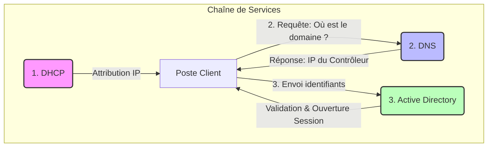

# 📘 TP B1-S2 : Des serveurs aux services

---

Ce dépôt regroupe les réponses et analyses du TD portant sur l'infrastructure matérielle des serveurs et la logique des services réseaux. Il couvre l'étude des facteurs de forme (Tour, Rack, Lame), la redondance matérielle, ainsi que la chaîne de services nécessaire à l'authentification d'un poste client sur un domaine.

---

## `📑`︲Sommaire

1. [Activité #1 : Découverte des configurations matérielles](#-activité-1--découverte-des-configurations-matérielles)
   * [Facteurs de forme (Tour, Rack, Lame)](#-facteurs-de-forme-des-serveurs-tour-rack-lame)
   * [Précisions Techniques (Q2 à Q5)](#-précisions-techniques-q2-à-q5)
   * [L'écosystème du Serveur Lame (Q6)](#-lecosystème-du-serveur-lame-q6)
   * [Tableau comparatif (Q7)](#-fiche-récapitulative-des-serveurs-q7)
   * [Stratégies de Redondance (Q8)](#-stratégies-de-redondance-q8)
2. [Activité #2 : Chaîne de services et connexion client](#-activité-2--chaîne-de-services-lors-de-la-connexion-dun-poste-client)
   * [Identification des services (DHCP, DNS, AD)](#-identification-des-services-essentiels-1-à-3)
   * [Schématisation du flux](#-ordre-chronologique-dappel-des-services)

---

## `🏗️`︲Activité #1 : Découverte des configurations matérielles

### `📐`︲Facteurs de forme des serveurs (Tour, Rack, Lame)

Le **facteur de forme** définit le format physique et le mode d’intégration du matériel. On distingue trois formats majeurs :

* **Serveur Tour (Tower) :** Format autonome proche d'un PC de bureau. Adapté aux TPE/PME sans salle serveur dédiée (Annexes 1 & 2).
* **Serveur Rack :** Conçu pour être glissé horizontalement dans une baie informatique de 19 pouces. Optimise l'espace et le refroidissement (Annexe 3).
* **Serveur Lame (Blade) :** Module ultra-compact inséré dans un châssis commun qui mutualise les ressources (Annexe 4).

---

### 🔧 Précisions Techniques (Q2 à Q5)

* **Le Socket (Q2) :** Emplacement physique sur la carte mère pour le processeur (CPU). Le nombre de sockets détermine la capacité d'évolution du serveur (ex: passer de 1 à 2 CPU).
* **Particularité de l'alimentation (Q3) :** Un serveur possède une **alimentation redondante** (2 blocs ou plus) **Hot-Plug** (extractible à chaud), permettant le remplacement sans coupure.
* **Stockage Rack (Q4) :** On utilise une **baie informatique (ou armoire 19 pouces)** pour centraliser le matériel et gérer le câblage.
* **Signification du format 1U (Q5) :** "U" = Unité de rack. **1U ≈ 4,445 cm**. C'est la hauteur standard d'un emplacement dans une baie.

---

### 🧩 L'écosystème du Serveur Lame (Q6)

Le serveur Dell PowerEdge M830 (Annexe 4) doit être inséré dans un **châssis**.

* **Rôle du Châssis (Q6.a) :** Il sert de "colonne vertébrale" en mutualisant l'énergie, le refroidissement (ventilateurs communs), la connectivité réseau et l'administration pour toutes les lames.
* **Alimentations (Q6.b) :** Un châssis peut embarquer jusqu'à **6 blocs d'alimentation** haute efficacité pour garantir la redondance de l'ensemble des lames.

---

### 📊 Fiche récapitulative des serveurs (Q7)

| Caractéristique | Annexe 1 : T140 | Annexe 2 : T440 | Annexe 3 : R240 | Annexe 4 : M830 |
| :--- | :--- | :--- | :--- | :--- |
| **Facteur de forme** | Tour | Tour | Rack (1U) | Lame (Blade) |
| **Nb. Processeurs (max)** | 1 | 2 | 1 | 4 |
| **Mémoire (max)** | 64 Go | 1 To | 64 Go | 3 To |
| **Slots RAM** | 4 slots | 16 slots | 4 slots | 48 slots |
| **Baies de stockage** | 4 baies (3.5") | 4, 8 ou 12 baies | 4 baies (3.5") | Jusqu'à 12 baies |
| **Nb. Alimentations** | 1 (365W) | 2 (Redondantes) | 2 (Redondantes) | Via Châssis (Redon.) |

---

### 🛡️ Stratégies de Redondance (Q8)

La redondance garantit la continuité de service (Haute Disponibilité) :

* **Alimentation :** Doublée pour pallier une panne électrique ou de bloc.
* **Disques durs :** Configuration **RAID** pour ne pas perdre de données si un disque tombe en panne.
* **Processeur :** Répartition de la charge sur plusieurs sockets.
* **Mémoire :** RAM **ECC** (Error Correcting Code) pour corriger les erreurs de données et éviter les crashs.
* **Ventilation :** Plusieurs ventilateurs redondants pour éviter la surchauffe.

---

## `🌐`︲Activité #2 — Chaîne de services lors de la connexion d’un poste client

### `🔍`︲Identification des services essentiels (1 à 3)

1. **DHCP (Port 67/68) :** Attribue l'adresse IP et les paramètres réseau. Sans lui, le poste est isolé.
2. **DNS (Port 53) :** Traduit le nom du domaine (`DESCARTESBLEU`) en adresse IP pour localiser le serveur.
3. **Active Directory (LDAP 389 / Kerberos 88) :** Vérifie l'identité (User/Pass) et applique les droits de l'utilisateur.

---

### `🔄`︲Ordre chronologique d’appel des services

```mermaid
graph TD
    Client[Poste Client]
    
    subgraph "Chaîne de Services"
    Step1(1. DHCP) -->|Attribution IP| Client
    Client -->|2. Requête: Où est le domaine ?| Step2(2. DNS)
    Step2 -->|Réponse: IP du Contrôleur| Client
    Client -->|3. Envoi identifiants| Step3(3. Active Directory)
    Step3 -->|Validation & Ouverture Session| Client
    end
    
    style Step1 fill:#f9f,stroke:#333,stroke-width:2px
    style Step2 fill:#bbf,stroke:#333,stroke-width:2px
    style Step3 fill:#bfb,stroke:#333,stroke-width:2px

```

---

### `📂`︲Services réseaux complémentaires

Une fois connecté, d'autres services assurent le travail quotidien :

* 📁 **SMB/CIFS (Port 445)** : Accès aux fichiers partagés.
* ⏱️ **NTP (Port 123)** : Synchronisation de l'heure (critique pour Kerberos/AD).
* 🖨️ **Impression** : Gestion des documents.

> [!TIP]
> Retiens bien la chaîne : **DHCP → DNS → AD**. Si un maillon casse, l'utilisateur ne peut pas travailler.

---
